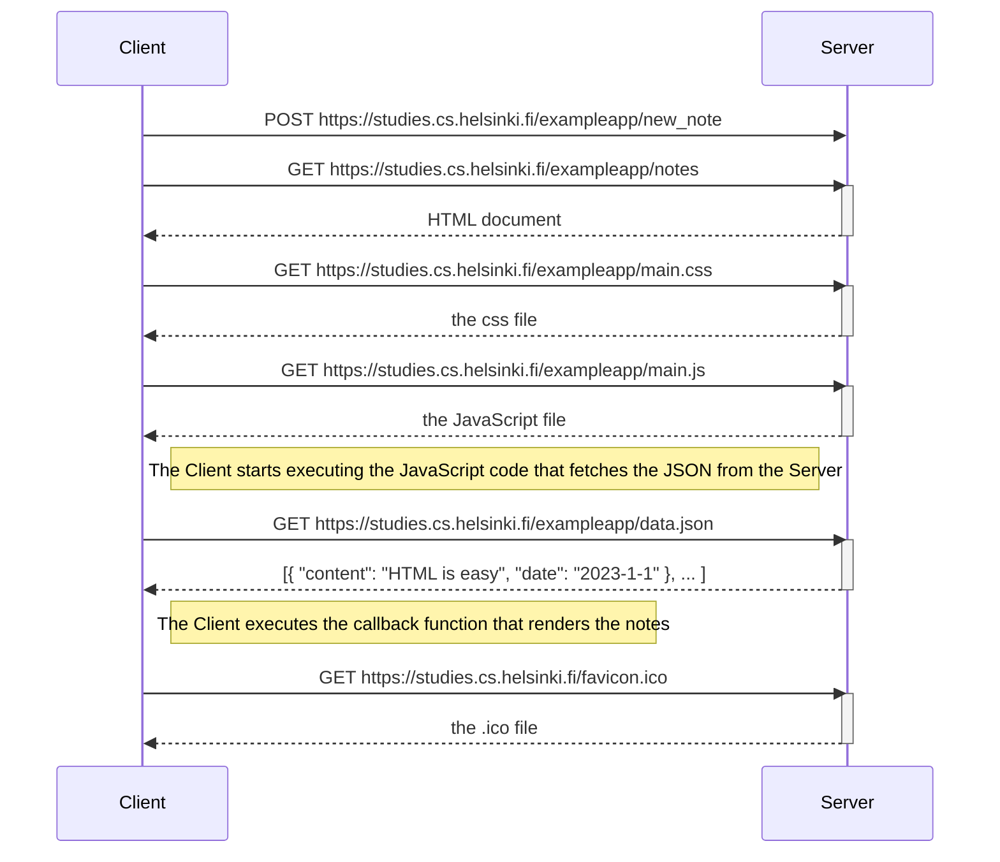
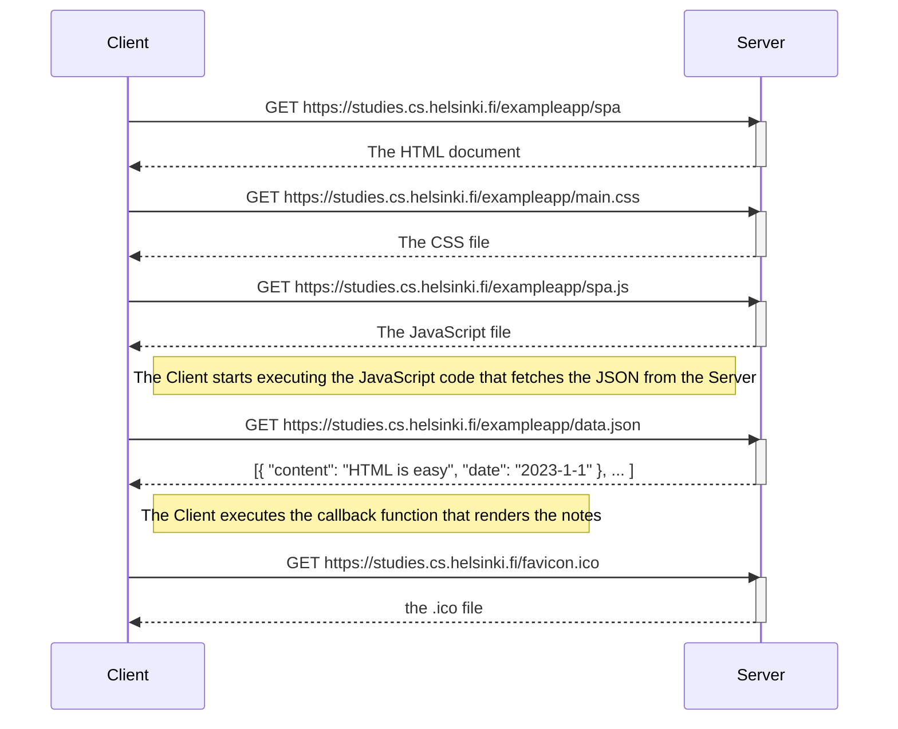

# csi4103-lab2
Sebastien Kock, 300137051
January 17th, 2023

## Exercise 0.4

Below is the Mermaid sequence diagram representing the operations when adding a new note to the multi-page version of the website https://studies.cs.helsinki.fi/exampleapp/notes.

## Exercise 0.5

This section contains the Mermaid sequence diagram for the single-page representation of the notes app (found at https://studies.cs.helsinki.fi/exampleapp/spa.)

