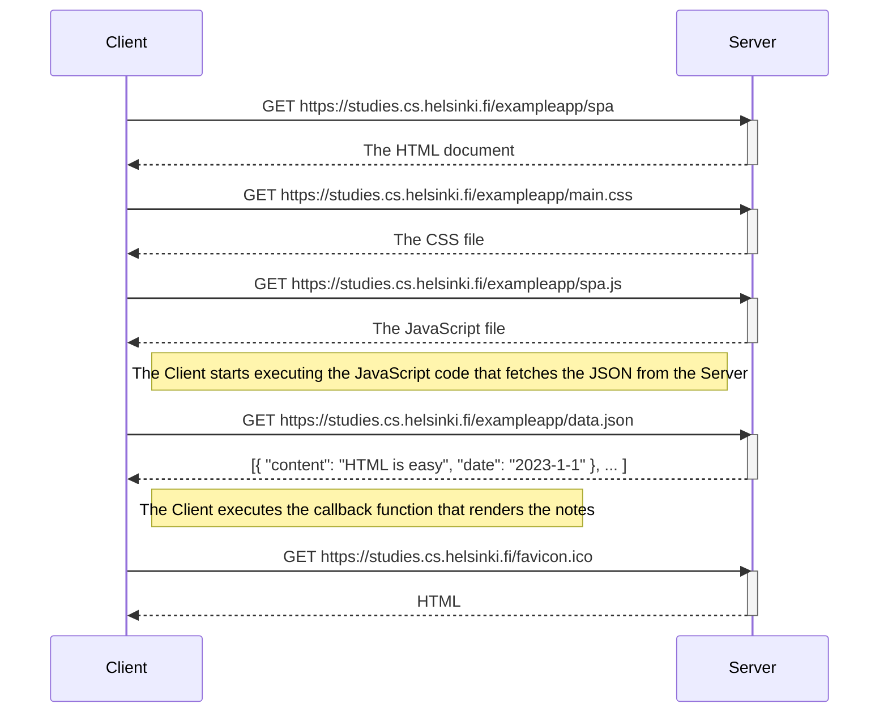
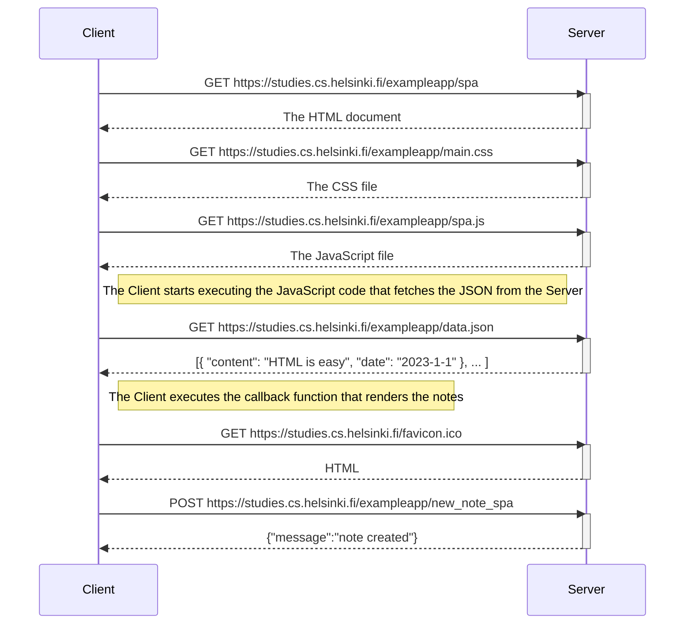

# csi4103-lab2
Sebastien Kock, 300137051
January 17th, 2023

## Exercise 0.4

Below is the Mermaid sequence diagram representing the operations when adding a new note to the multi-page version of the website https://studies.cs.helsinki.fi/exampleapp/notes. Upon adding the new note to the app, a copy of the current state of the app is essentially created, but with the new note added. Once the new note has been added to the list, the page reloads. This sequence of events produces the following diagram:

## Exercise 0.5

This section contains the Mermaid sequence diagram for the single-page representation of the notes app (found at https://studies.cs.helsinki.fi/exampleapp/spa).

## Exercise 0.6

Unlike the sequence diagram for the multi-page version of the app, upon adding a new note to the single-page version of the app, the page does not refresh. Instead, the new entry gets added directly to the JSON file and is then displayed, producing the following diagram:

